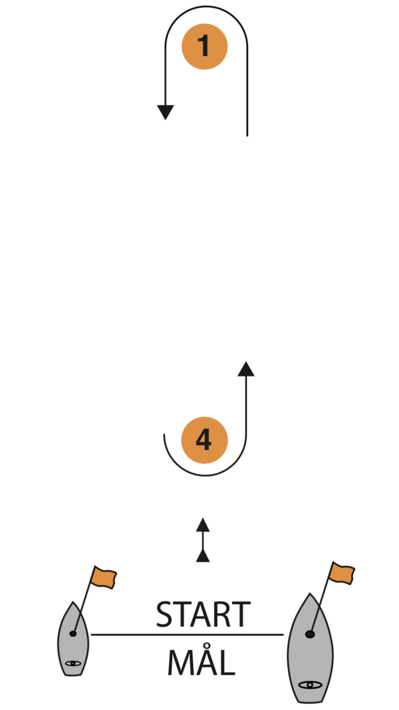

# Inbjudan för sprint

**Tävling:** Junior Sprinten Cupen Svealand

**Datum:** 13 juni 2020

**Arrangör:** Ekerö Båtklubb

**Hemsida:** [marsater.github.io](https://marsater.github.io/)

## 1. Regler

*1.1*   Tävlingen genomförs i överensstämmelse med reglerna så som de är           definierade i Kappseglingsreglerna (KSR) och med Addendum Q.

Vid eventuell konflikt mellan regler har Addendum Q företräde.

*1.2*   Alla båtar kan komma att i enlighet med World Sailing Regulation 20, föra reklam vald och tillhandahållen av arrangören.

*1.3*   Tävlande ska följa SSF:s licensbestämmelser.

*1.4*   Vid protest används en röd flagga.

*1.5*   En tävlande som lämnat land ska ha på sig personlig flytutrustning. Den här regeln gäller inte vid kortvarigt byte eller justering av kläder eller personlig utrustning eller när den tävlande befinner sig i hamn eller under däck. Våtdräkter och torrdräkter är inte personlig flytutrustning. Detta ändrar KSR 40. En båt som bryter mot den här regeln kan varnas eller straffas på det sätt som protestkommittén finner lämpligt (DP).

## 2. Villkor för att delta

*2.1*    Den tävlande ombord som har ansvaret ska vara medlem av en klubb som är ansluten till sin nationella myndighet.

*2.2*   Varje deltagande båt ska vara ansvarsförsäkrad.

*2.3*    Tävlande deltar i regattan helt på egen risk. Se KSR 4, Besluta att kappsegla. Den arrangerande myndigheten accepterar inget ansvar för sak- eller personskador som någon råkat ut för i samband med eller före, under eller efter tävlingen.

*2.4*   Deltagarantalet är begränsat till 25 personer.

## 3. Anmälan

*3.1*   Anmälan ska göras senast den 7 Juni 2020, kl 23:55 på [denna hemsida.](https://marsater.github.io/anmalan/)

*3.2*   Anmälan ska innehålla de uppgifter som efterfrågas i anmälningsformuläret.

*3.3*   Anmälningsavgiften är den som uppges i anmälningsformuläret.

## 4. Registrering

4.1     Registrering ska göras på tävlingsexpeditionen (klubbhusets altan) mellan 8:00 till 8:45 på lördagen den 13 juni 2020.

Förhinder meddelas till arrangören, [kontaktinformation hittas på denna sida.](https://marsater.github.io/)

## 5. Seglingsföreskrifter

5.1     Seglingsföreskrifterna lämnas ut i samband med registreringen.

## 6.   Tidsprogram

*6.1*   Program

* Registrering 8:00 till 8:45.

* Invigning &amp; Skepparmöte 9:00

* Tid för första varningssignal 9:45

* Tid för sista påbörjade omgång 16:45

* Prisutdelning snarast efter.

### 7.  Tävlingsformat

*7.1*           Tävlingen genomförs som sprint, vilket innebär ett antal korta kappseglingar om 3 båtar i taget. Kan ändra via segling föreskrifterna.

*7.2*           Tävlingen genomförs i båtar av typ 606or, med en besättning på 2 eller 3 tävlande inklusive skeppare.

*7.3*           Båtar tillhandahålls av arrangören.

### 8.  Kappseglingsområde

*8.1*    Kappseglingarna genomförs Kyrkfjärden i Mälaren.

### 9.   Banan

*9.1*    Banan är en kryss-läns-bana.

Start - 1 - 4 - 1 - mål

### 10.   Protester och straff

*10.1*         Addendum Q gäller.

*10.2*   vid all kontakt straffas båda båtarna med poängtillägg. Framgår i seglingsföreskrifterna.

### 11.     Priser

*11.1* Priser delas ut till topp 3 samt och  ¼ av det anmälda.

### 13.    Regler för stödpersoner

*a)*             Stödpersoner ska följa Svenska Seglarförbundets säkerhetskodex. Samt ej medvetet förstöra för eget, andra team/lag och eller tävlingsorganisationen.
